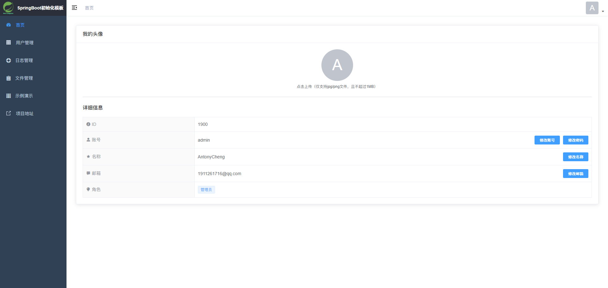
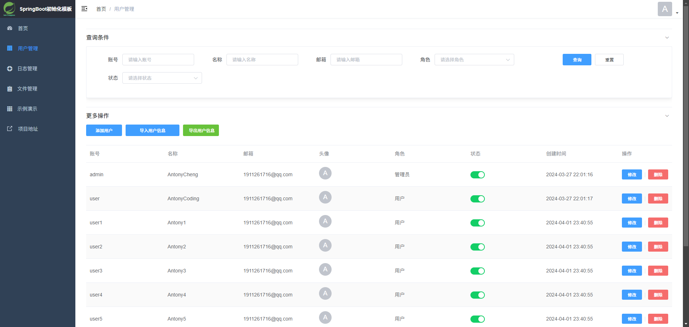
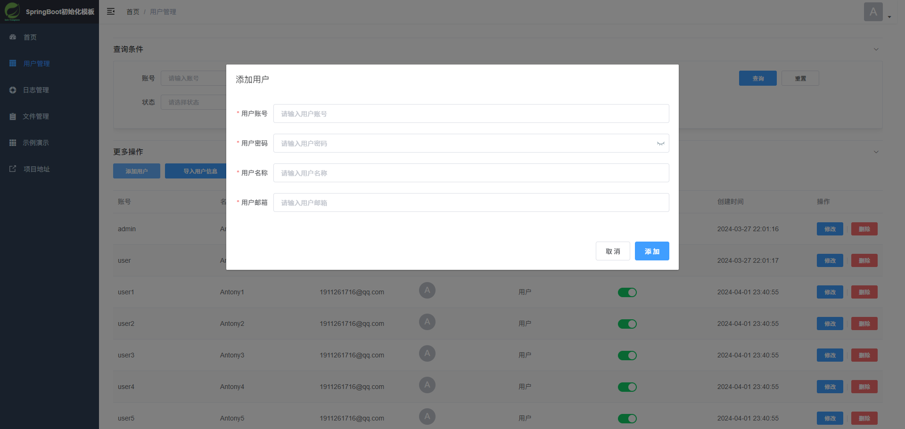
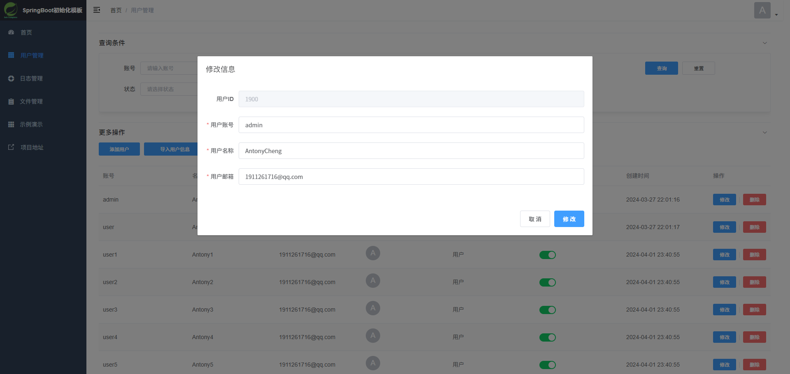
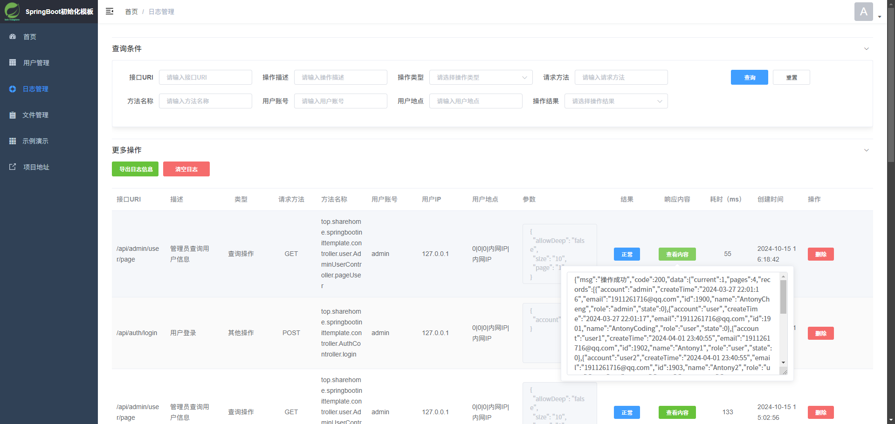

<p align="center">
  <a href="https://github.com/AntonyCheng">
    
  </a>
</p>

> **作者：[AntonyCheng](https://github.com/AntonyCheng)**
>
> **版本号：v2.1.9-jdk11-pre**
>
> **开源协议：[Apache License 2.0](https://www.apache.org/licenses/LICENSE-2.0.html)**
> 
> **注意事项①：该README跟随版本号的更新而更新，所有Git分支其实都是Pre预览分支，其中最新的内容并不能及时展现在该README中，所以想要使用稳定且具有对应说明的版本，推荐从Releases中下载。但是想要时刻跟进模板开发进度，也可以直接从各个Git分支拉取，查看每次提交的对应说明！**
>
> **注意事项②：由于代码中包含了大量JDK9+新特性，所以从v2.1.8版本开始，v2-jdk8&11分支不再兼容JDK8，版本号也从v2.1.8-jdk8&11改名为v2.1.8-jdk11，但分支名称依旧保持原名！**

# SpringBoot初始化模板

**基于 Java Web 项目的 SpringBoot 框架初始化模板**，该模板整合了常用的框架，广泛支持JDK11和JDK17，部分版本兼容JDK8，该模板适用于前后端分离项目启动开发，保证大家在此基础上能够快速开发自己的项目，同时也适合入门学习，本项目会由作者持续更新。

* [SpringBoot初始化模板](#springboot初始化模板)
  * [模板特点](#模板特点)
    * [主流框架](#主流框架)
    * [业务特性](#业务特性)
  * [业务功能](#业务功能)
    * [示例业务](#示例业务)
    * [单元测试](#单元测试)
  * [快速上手](#快速上手)
    * [必须执行](#必须执行)
    * [可选执行](#可选执行)
      * [启动前端项目](#启动前端项目)
      * [整合缓存服务](#整合缓存服务)
        * [整合系统缓存（Redis）](#整合系统缓存redis)
        * [整合业务缓存（Redisson）](#整合业务缓存redisson)
        * [整合本地缓存（Caffeine）](#整合本地缓存caffeine)
      * [整合消息队列](#整合消息队列)
        * [激活消息队列](#激活消息队列)
        * [自定义消息队列](#自定义消息队列)
      * [整合Elasticsearch](#整合elasticsearch)
      * [整合MongoDB](#整合mongodb)
      * [整合对象存储服务](#整合对象存储服务)
        * [整合腾讯云COS](#整合腾讯云cos)
        * [整合MinIO](#整合minio)
        * [整合阿里云OSS](#整合阿里云oss)
      * [整合验证码](#整合验证码)
      * [整合邮件](#整合邮件)
      * [整合离线IP库](#整合离线ip库)
      * [配置国际化](#配置国际化)
      * [配置SaToken](#配置satoken)
        * [开启鉴权认证功能](#开启鉴权认证功能)
          * [鉴权功能](#鉴权功能)
          * [认证功能](#认证功能)
        * [开启JWT](#开启jwt)
          * [整合Redis](#整合redis)
          * [整合JWT](#整合jwt)
          * [确认鉴权模式](#确认鉴权模式)
      * [配置定时任务](#配置定时任务)
        * [SpringBoot任务调度](#springboot任务调度)
        * [XxlJob任务调度](#xxljob任务调度)
        * [PowerJob任务调度](#powerjob任务调度)
      * [配置WebSocket](#配置websocket)
      * [配置SpringBootAdmin](#配置springbootadmin)
      * [配置Canal](#配置canal)
        * [Canal简介](#canal简介)
        * [搭建Deployer&Adapter系统](#搭建deployeradapter系统)
        * [搭建Deployer&Client系统](#搭建deployerclient系统)
  * [前端预览](#前端预览)
  * [申明&联系我](#申明联系我)
  * [项目历史](#项目历史)
  * [下一步开发计划](#下一步开发计划)

## 模板特点

### 主流框架

- **Java 11**
  - 兼容性，详情见[兼容Java8](#兼容java8)
- **SpringBoot 2.7.18**
  - spring-boot-starter-web == 基于 Spring MVC 的 Web 应用依赖
  - spring-boot-starter-undertow == 轻量级、高性能 Servlet 容器
  - spring-boot-starter-aop == 提供面向切面编程功能
  - spring-boot-starter-validation == 参数校验依赖
  - spring-boot-starter-data-mongodb == Spring Data MongoDB 依赖
  - spring-boot-starter-email == Spring Data Email 依赖
  - spring-boot-starter-freemaker == 模板引擎依赖
  - spring-boot-starter-test == Spring Boot Test 依赖
  - spring-boot-configuration-processor == 生成配置元数据信息，辅助开发工具
- **前端模板**
  - vue-admin-template 4.4.0 == 这是一个极简的 vue admin 管理后台，只包含了 Vue 2 & Element UI & axios & iconfont & permission control & lint
- **Netty**
  - netty-all 4.1.112.Final == Netty 框架
- **数据驱动层**
    - mysql-connector-j 8.0.33 == Java 连接 MySQL 依赖
    - mybatis-plus-boot-starter 3.5.7 == MyBatis-Plus 框架
    - mybatis-plus-annotation 3.5.7 == MyBatis-Plus 注解依赖
    - shardingsphere-jdbc 5.5.0 == 分布式数据库解决方案
    - druid-spring-boot-starter 1.2.23 == Druid 连接池
- **工具类**
  - lombok 1.18.34 == POJO 简化工具
  - hutool-all 5.8.29 == Hutool 工具类
  - commons-lang3 3.15.0 == Apache Commons Lang 工具类
  - commons-io 2.16.1 == Apache Commons IO 工具类
  - commons-codec 1.17.1 == Apache Commons Codec 工具类
  - commons-pool2 2.12.0 == Apache Commons Pool 工具类
  - commons-collections4 4.5.0-M2 == Apache Commons Collections 工具类
  - commons-math3 3.6.1 == Apache Commons Math 工具类
  - commons-compress 1.26.2 == Apache Commons Compress 工具类
  - okhttp 4.12.0 == OK Http 工具类
  - okio 3.9.0 == OK IO 工具类
  - fastjson2 2.0.52 == Fast JSON 工具类
  - fastjson2-extension-spring6 2.0.52 == FastJSON 工具拓展类
  - ip2region 2.7.0 == 离线 IP 地址定位库
- **权限校验**
  - sa-token-spring-boot-starter 1.38.0 == SaToken 认证鉴权框架
  - sa-token-core 1.38.0 == SaToken 认证鉴权框架核心依赖
  - sa-token-jwt 1.38.0 == SaToken 认证鉴权框架 JWT 依赖
  - sa-token-redis-jackson 1.38.0 == SaToken 认证鉴权框架 Redis 依赖
- **缓存服务**
  - spring-boot-starter-data-redis == Spring Data Redis 依赖
  - spring-boot-starter-cache == Spring Cache 依赖
  - redisson 3.33.0 == Redis 的基础上实现的 Java 驻内存数据网格
- **本地缓存服务**
  - caffeine 3.1.8 == Caffeine 本地缓存依赖
- **消息队列**
  - spring-boot-starter-amqp == 支持 AMQP （高级消息队列协议）消息代理
  - spring-rabbit-test == Spring 支持对 RabbitMQ 消息队列的单元测试
- **搜索引擎**
  - easy-es-boot-starter 2.0.0 == 简化 Elasticsearch 搜索引擎，可以像 Mybatis-Plus 操作 MySQL 一样操作 Elasticsearch 的开源框架
  - elasticsearch 7.14.0 == Elasticsearch 依赖
  - elasticsearch-rest-high-level-client 7.14.0 == ES 高级别客户端依赖
  - logstash-logback-encoder 7.3 == Logstash 依赖
- **对象存储（OSS）**
  - cos_api 5.6.221 == 腾讯云 COS
  - aliyun-sdk-oss 3.18.1 == 阿里云 OSS 
  - minio 8.5.11 == Minio 对象存储
- **文件操作**
  - poi 5.3.0 == 操作 Word
  - poi-tl 1.12.2 == 操作 Word 模板
  - easyexcel 4.0.1 == 操作 Excel
  - x-easypdf 3.1.0 == 操作 PDF
  - thymeleaf 3.1.2.RELEASE == 操作 PDF Thymeleaf 模板
  - jte 2.3.2 == 操作 PDF JTE 数据源模板
- **接口文档 & API调试**
  - knife4j-openapi3-spring-boot-starter 4.5.0 == Knife4j 依赖
- **外接平台（建议生产环境上使用 Docker 容器化技术自行部署一套平台，不要通过模板中的模块代码直接进行编译部署，主要原因是为了适配模板，外接平台中的某些代码被作者修改过）**
  - xxl-job-core 2.4.1 == 分布式定时任务管理平台
  - powerjob-worker-spring-boot-starter 4.3.9 == 更强劲的分布式定时任务管理平台（个人认为，针对于中小型项目而言，PowerJob 并不适用，可以对比一下 XxlJob ，就能发现 PowerJob 很多功能用不上，当然这得让开发者自己考虑，所以模板依然保留了 XxlJob 的集成模块）
  - spring-boot-admin-client 2.7.9 == SpringBoot 服务监控平台
  - canal.client 1.1.7 == Canal-Deployer & Canal-Adapter 数据同步系统

### 业务特性

- 使用 Undertow 服务器替换掉 Tomcat 服务器，无阻塞更适合高并发
- Web UI 选用 vue-admin-template 前端模板，基于 Vue 2 和 Element UI ，极易上手开发调试
- SaToken 可配置分布式登录 & 认证 & 鉴权
- AOP 逻辑处理示例
- 自定义注解处理示例
- 验证码分布式校验
- 无感注解式记录日志
- 全局请求拦截器 & 过滤器
- 全局异常处理器
- 封装统一响应对象
- 自定义响应码
- 可配置式国际化
- 可配置式多类型对象存储
- 可实现多级缓存
- 毫秒级离线 IP 查询
- SpringDoc + Knife4j 接口文档
- 全局跨域处理
- Spring 上下文处理工具
- JSON 长整型精度处理
- 自动字段填充器
- 基于 Netty 的 WebSocket 全双工通信设计示例
- 对象存储、消息队列、缓存、分布式锁、限流、国际化、网络、Excel、Word、PDF 等工具类

## 业务功能

### 示例业务

- 提供模板 SQL 示例文件（业务数据库 & XxlJob 数据库 & PowerJob 数据库）
- 用户登录、注册、注销、信息获取、添加、查询、删除以及修改等后端接口及前端页面
- Spring Scheduler 单机版定时任务示例
- XxlJob & PowerJob 使用逻辑代码示例
- RabbitMQ 多类型消息队列逻辑代码示例
- AOP 逻辑代码示例
- 自定义注解逻辑代码示例
- 国际化逻辑代码示例
- 验证码逻辑代码示例
- 操作 Elasticsearch 代码示例
- 操作 MongoDB 代码示例
- 操作 Excel、Word 以及 PDF 文件代码示例

### 单元测试

- JUnit5 单元测试
- 示例单元测试类

## 快速上手

> 拉取项目模板之后需要确保所有依赖下载完成，以下的操作都是针对于 application.yaml 文件，即按需修改配置就能引入相关模板功能。

### 必须执行

1. 执行 `sql/init_db.sql` 、 `sql/init_xxl_job.sql` 以及 ` sql/init_power_job.sql` 文件，模板默认管理员账号：admin，默认用户账号：user，密码均为123456；

2. 修改 `src/main/resources/mysql/mysql.yaml` 文件：

   ```yaml
   dataSources:
     ds_master:
       dataSourceClassName: com.zaxxer.hikari.HikariDataSource
       driverClassName: com.mysql.cj.jdbc.Driver
       url: jdbc:mysql://127.0.0.1:3306/init_db?serverZoneId=Asia/Shanghai&useUnicode=true&characterEncoding=utf-8&zeroDateTimeBehavior=convertToNull&useSSL=false&allowPublicKeyRetrieval=true&rewriteBatchedStatements=true
       username: root
       password: 123456
   ```
   
   > 在这个文件中还能看到很多其他的配置，如有需要，请开发者自行学习 ShardingSphere 5.5.0 版本框架，理解相关配置；
   
3. 直到这一步之后，模板后端代码就已经可以直接启动了，访问 `http://localhost:38080/api/doc.html` 即可打开接口文档；

### 可选执行

> 为了方便开发者快速找到配置文件需要修改的位置，一律使用 todo 待办进行标识，请务必“**必须执行**”。

#### 启动前端项目

如果需要启动前端进行开发或者调试，开发者需要前往 `ui` 文件夹，打开 `vue-admin-template` 项目，参考其 `README.md` 文件启动即可。

#### 整合缓存服务

**说明**：该模板中存在两种 Redis 服务，第一种是系统缓存服务（ **对应整合系统缓存** ），第二种是业务缓存服务（ **对应整合业务缓存** ）。前者承担系统框架本身的缓存服务，例如用户分布式登录信息的缓存；后者承担开发者业务逻辑所需的缓存操作，例如分布式锁、限流工具等。除了 Redis 服务，还有 Caffeine 本地缓存服务，详情请查看以下内容。

##### 整合系统缓存（Redis）

系统缓存服务主要为一些依赖 spring-boot-starter-data-redis 原生操作的框架而设计，例如模板中用于校验权限的 SaToken 框架就有借用 Redis 进行分布式登录或校验的需求，系统缓存的过程对开发者能做到透明。

1. 取消排除 `RedisAutoConfiguration`  类：

   ```yaml
   spring:
     # 框架依赖自动配置选择
     autoconfigure:
       exclude:
         # todo 是否开启Redis依赖类（如果要启动Redis，就将RedisAutoConfiguration注释掉，该配置类一旦被注释，就需要设置Redis相关配置，预先关闭）
         #- org.springframework.boot.autoconfigure.data.redis.RedisAutoConfiguration
   ```

2. 修改 Redis 相关配置，切记注意单机模式和集群模式无法共存，默认开启单机模式，注释掉集群模式相关代码，同时默认没有密码，所以密码也被注释掉：

   ```yaml
   spring: 
     # 系统缓存Redis配置（这里的Redis配置主要用于鉴权认证等模板自带服务的系统缓存服务）
     redis:
       # 单机地址（单价模式配置和集群模式配置只能存在一个）
       host: 127.0.0.1
       # 单机端口，默认为6379
       port: 6379
       # 集群地址（单价模式配置和集群模式配置只能存在一个）
       #cluster:
       #  nodes:
       #    - 127.0.0.1:6379
       #    - 127.0.0.1:6380
       #    - 127.0.0.1:6381
       #    - 127.0.0.1:6382
       #    - 127.0.0.1:6383
       #    - 127.0.0.1:6384
       # 数据库索引
       database: 0
       # 密码（考虑是否需要密码）
       #password: 123456
       # 连接超时时间
       timeout: 3s
       # redis连接池
       lettuce:
         pool:
           # 最小空闲连接数
           min-idle: 8
           # 最大空闲连接数
           max-idle: 25
           # 最大活动连接数
           max-active: 50
           # 最大等待时间/ms
           max-wait: 3000
   ```

3. 此时项目就能够直接启动， Redis 相关配置就完成了，特别说明一下，为了适应模板的通用性，该模板中依旧保留了 spring-boot-starter-data-redis 中 RedisTemplate 的原生操作途径，在 `top.sharehome.springbootinittemplate.config.redis` 包中设计了 RedisTemplate 的 Bean，同时更新了其序列化方式以防止存入 Redis 之后出现乱码，这意味着开发者依旧可以使用 RedisTemplate 的方式将系统缓存和业务缓存合二为一，这种保留做法仅仅是为了可拓展性，所以没有围绕 RedisTemplate 编写缓存工具类，如果需要使用缓存工具类，详情见 **整合业务缓存** 。

##### 整合业务缓存（Redisson）

业务缓存服务主要是为了满足开发者在编码过程中的缓存需求，例如接口限流、分布式锁等。

1. 修改 Redisson 配置，此时单机版本和集群版本的启动状态可以自定义：

   - 都不开启（都为 false ）：模版不会将 Redisson 相关依赖纳入反转控制容器中；
   - 仅开启一个（一个为 true ，一个为 false ）；
   - 都开启（都为 true ）：模版只会加载单机版本的 Redisson 配置；

   ```yaml
   # Redisson配置（这里的Redisson配置主要用来系统业务逻辑的缓存服务）
   # 如果同时开启单机版本和集群版本，只有单机版本生效
   redisson:
     # 线程池数量
     threads: 4
     # Netty线程池数量
     netty-threads: 8
     # 限流单位时间，单位：秒
     limit-rate-interval: 1
     # 限流单位时间内访问次数，也能看做单位时间内系统分发的令牌数
     limit-rate: 2
     # 每个操作所要消耗的令牌数，系统分发的令牌数一定要大于等于操作消耗的令牌树，不然会报错
     limit-permits: 1
     # Redis单机版本
     single-server-config:
       # todo 是否启动单机Redis（Redisson）缓存（预先关闭）
       enable-single: true
       # 单机地址（一定要在redis协议下）
       address: redis://127.0.0.1:6379
       # 数据库索引
       database: 1
       # 密码（考虑是否需要密码）
       #password: 123456
       # 命令等待超时，单位：毫秒
       timeout: 3000
       # 发布和订阅连接池大小
       subscription-connection-pool-size: 25
       # 最小空闲连接数
       connection-minimum-idle-size: 8
       # 连接池大小
       connection-pool-size: 32
       # 连接空闲超时，单位：毫秒
       idle-connection-timeout: 10000
     # Redis集群版本
     cluster-servers-config:
       # todo 是否启动集群redisson（Redisson）缓存（预先关闭）
       enable-cluster: false
       # Redis集群节点（一定要在Redis协议下）
       node-addresses:
         - redis://127.0.0.1:6379
         - redis://127.0.0.1:6380
         - redis://127.0.0.1:6381
         - redis://127.0.0.1:6382
         - redis://127.0.0.1:6383
         - redis://127.0.0.1:6384
       # 密码（考虑是否需要密码）
       #password: 123456
       # master最小空闲连接数
       master-connection-minimum-idleSize: 16
       # master连接池大小
       master-connection-pool-size: 32
       # slave最小空闲连接数
       slave-connection-minimum-idle-size: 16
       # slave连接池大小
       slave-connection-pool-size: 32
       # 连接空闲超时，单位：毫秒
       idle-connection-timeout: 10000
       # 命令等待超时，单位：毫秒
       timeout: 3000
       # 发布和订阅连接池大小
       subscription-connection-pool-size: 25
   ```

2. 此时项目就能够直接启动， Redisson 相关配置就完成了，模板为了降低开发者的模板使用门槛，特意针对 Redisson 进行进一步封装，在 `top.sharehome.springbootinittemplate.utils.redisson` 包中设计了缓存工具类 CacheUtils 、限流工具类 RateLimitUtils 以及 LockUtils 分布式锁工具类供开发者使用，使用参考示例单元测试类。

##### 整合本地缓存（Caffeine）

本地缓存服务主要是为了满足开发者在编码过程中的多级缓存的需求，通过牺牲本地机器空间换取网络通讯时间的做法，理论上这种服务器内存缓存的效率是最高的，但是不推荐用其替代上面系统缓存或者业务缓存，此种缓存方式仅作系统性能提升的辅助方案，例如获取登录信息可以做“本地缓存 ==> 业务缓存 ==> 数据库”三级缓存方案。

1. 修改 Caffeine 配置：

   ```yaml
   # Caffeine本地缓存配置
   caffeine:
     # todo 是否启动（预先关闭）
     enable: true
     # 最后一次写入或访问后经过固定时间过期，单位：秒
     expired: 1800
     # 缓存初始容量
     init-capacity: 256
     # 缓存最大容量，超过之后会按照最近最少策略进行缓存剔除
     max-capacity: 10000
     # 是否允许空值null作为缓存的value
     allow-null-value: true
   ```

2. Caffeine 相关配置就完成了，模板为了降低开发者的模板使用门槛，特意针对 Caffeine 进行进一步封装，在 `top.sharehome.springbootinittemplate.utils.caffeine` 包中设计了本地缓存工具类 LocalCacheUtils 供开发者使用，使用参考示例单元测试类。

#### 整合消息队列

**说明**：该模板中存在一套较为全面的 RabbitMQ 消息队列解决方案，具有消费者手动 ACK 示例、死信队列、延迟队列等特性，开发者不仅可以直接使用模板中存在的默认队列，还可以根据自己的需求对原有的解决方案进行拓展以设计出满足自身项目特色的消息队列，同时该模板对拓展的消息队列具有一定规则性兼容。

##### 激活消息队列

1. 修改消息队列相关配置，同时选择配置单机 RabbitMQ 或者集群 RabbitMQ ，切记这两者无法共存，使用其中一个配置的同时需要把另一个配置给注释或者删除掉（不建议删除，说不一定万一哪天有用呢），然后根据自己搭建的 RabbitMQ 进行相关配置：

   ```yaml
   spring:
     # RabbitMQ配置
     rabbitmq:
       # todo 是否开启RabbitMQ（预先关闭）
       enable: true
       # 获取消息最大等待时间（单位：毫秒）
       max-await-timeout: 3000
       # 单机 RabbitMQ IP（单价模式配置和集群模式配置只能存在一个）
       host: 127.0.0.1
       # 单机 RabbitMQ 端口
       port: 5672
       # 集群RabbitMQ（单价模式配置和集群模式配置只能存在一个）
       #addresses: 127.0.0.1:5672,127.0.0.1:5673,127.0.0.1:5674
       # 虚拟主机
       virtual-host: /
       # 用户名
       username: guest
       # 密码
       password: guest
       # 消息确认（ACK）
       publisher-confirm-type: correlated #确认消息已发送到交换机(Exchange)
       publisher-returns: true #确认消息已发送到队列(Queue)
       template:
         mandatory: true
       # 是否手动ACK
       listener:
         type: simple
         direct:
           acknowledge-mode: manual
         simple:
           acknowledge-mode: manual
   ```
   
2. 配置好之后即可启动项目，在模板中存在默认的三个消息队列配置，它们在 `top.sharehome.springbootinittemplate.config.rabbitmq.defaultMq` 包下，分别是 `DefaultRabbitMq` （默认的普通队列）、`DefaultRabbitMqWithDlx` （默认的带有死信队列的消息队列）、`DefaultRabbitMqWithDelay` （默认的延迟队列），这三个队列可以直接使用，它们在 `top.sharehome.springbootinittemplate.utils.rabbitmq.RabbitMqUtils` 工具类中由“default”开头的方法，当然开发者也可以按照一定的模板规则来自定义消息队列，这些消息队列会与 RabbitMqUtils 工具类兼容。

##### 自定义消息队列

1. 关于自定义消息队列，这里给出最简单的方式，首先开发者需要考虑自定义哪种形式的消息队列：

   - 普通消息队列：即最基础的消息队列，能够支持最基本的消息投递和消息消费的能力，简单易懂；
   - 带有死信队列的消息队列：与普通消息队列相比，带有死信队列的消息队列能够在消息被拒绝消费之后选择将消息列入死信队列中，而并不是直接丢弃或者再次扔进队列中等待消费，这种的应用场景多用于不可丢失消息的处理或者对拒绝消费的消息再处理；
   - 延迟队列：投递消息之后并不能从队列中马上取出消息进行消费；

   这些具体的消息队列特性往往需要开发者掌握一定的前置知识基础；

2. 然后粘贴 `top.sharehome.springbootinittemplate.config.rabbitmq.defaultMq.DefaultRabbitMq` 类，复制到 `top.sharehome.springbootinittemplate.config.rabbitmq.customizeMq` 包中，并且重命名（在 DefaultRabbitMq 的文档注释中有具体说明），注意不要和 DefaultRabbitMq 类重复，不然会造成 Bean 注入冲突，这里假设命名成 TestRabbitMq ；

3. 在 TestRabbitMq 中进行文本替换，将所有 “default” 替换成 “test” 即可，如果想要使用自定义的消息队列配置，直接使用 RabbitMqUtils 工具类中形参带有 “Class” 类型的方法即可（详情见 RabbitMqUtils 文档注释）。

注意：这里只给出了最简单的自定义方式，开发者在理解这种“替换”变换和阅读相关源码的基础上可以对模板进行更加自定义的改造。

#### 整合Elasticsearch

与其说是整合 Elasticsearch 搜索引擎，不如说是整合 Easy-ES 框架，正因为 Easy-ES 框架过于强大， Elasticsearch 中繁琐的操作才能得以简化，但是不要依赖这个工具而不去深入了解学习 Elasticsearch 这个伟大的搜索引擎，Easy-ES 的开发者就已经说得很明白了：这套框架的是站在 elasticsearch-rest-high-level-client 和 MyBatis-Plus 的肩膀上创作的，而前者的底层操作逻辑正是 Elasticsearch 的操作逻辑。

在使用该模板中的 Elasticsearch 相关功能之前一定要前往 Easy-ES 官网将快速入门部分通读一遍，要有一个大概的了解才能容易上手。

1. 修改 Easy-ES 相关配置，重点关注 Elasticsearch 的部署地址，由于框架自身原因， Elasticsearch 的相关依赖被固定在 **7.14.0** ，好在 Elasticsearch 在小版本之间兼容性还不错，所以理论上部署 7.x.x 的 Elasticsearch 即可满足要求，当然推荐部署 7.14.0 版本的 Elasticsearch ，然而 Elasticsearch 7.x.x 这个大版本依旧在更新维护，所以可以放心使用：

   ```yaml
   # Easy-ES配置
   easy-es:
     # todo 是否启动（预先关闭）
     enable: true
     # es连接地址+端口 格式必须为ip:port,如果是集群则可用逗号隔开
     address: 127.0.0.1:9200
     # 如果无账号密码则可不配置此行
     #username:
     # 如果无账号密码则可不配置此行
     #password:
     # 多数据源
     #dynamic:
       #datasource:
         #ds1:
           #address: 127.0.0.1:9201
           # 如果无账号密码则可不配置此行
           #username:
           # 如果无账号密码则可不配置此行
           #password:
           #...（以下配置和单数据源类似）
         #ds2:
           #...（以下配置和ds1相似）
     # 默认为http 可缺省
     schema: http
     # 打印banner 若您不期望打印banner,可配置为false（预先关闭）
     banner: false
     # 心跳策略时间 单位:ms
     keep-alive-millis: 30000
     # 连接超时时间 单位:ms
     connect-timeout: 5000
     # 通信超时时间 单位:ms
     socket-timeout: 600000
     # 连接请求超时时间 单位:ms
     connection-request-timeout: 5000
     # 最大连接数 单位:个
     max-conn-total: 100
     # 最大连接路由数 单位:个
     max-conn-per-route: 100
     global-config:
       # 索引处理模式,smoothly:平滑模式, not_smoothly:非平滑模式, manual:手动模式,,默认开启此模式
       process-index-mode: manual
       # 开启控制台打印通过本框架生成的DSL语句,默认为开启,测试稳定后的生产环境建议关闭,以提升少量性能
       print-dsl: true
       # 当前项目是否分布式项目,默认为true,在非手动托管索引模式下,若为分布式项目则会获取分布式锁,非分布式项目只需synchronized锁.
       distributed: false
       # 重建索引超时时间 单位小时,默认72H 可根据ES中存储的数据量调整
       reindexTimeOutHours: 72
       # 异步处理索引是否阻塞主线程 默认阻塞 数据量过大时调整为非阻塞异步进行 项目启动更快
       async-process-index-blocking: true
       db-config:
         # 是否开启下划线转驼峰 默认为false
         map-underscore-to-camel-case: false
         # 索引前缀,可用于区分环境  默认为空 用法和MP的tablePrefix一样的作用和用法
         index-prefix: template_
         # id生成策略
         # 1、customize为自定义，_id值由用户生成，比如取MySQL中的数据id，如缺省此项配置，则_id默认策略为ES自动生成
         # 2、none为默认策略，由ES自动生成id
         # 3、uuid为全局唯一策略
         id-type: none
         # 数据刷新策略,默认为不刷新,若对数据时效性要求比较高,可以调整为immediate,但性能损耗高,也可以调整为折中的wait_until
         refresh-policy: immediate
   ```

2. 配置完之后已经就能够使用一些方法了，但是并不是全部，想要让框架功能得以发挥就必须有操作 Mybatis-Plus 的思想，具体代码示例在最后一步，下面仅作文字说明；

3. 准备一个包来存放属于 Easy-ES 映射接口，然后在项目启动类上使用 @EsMapperScan 注解注明该包的全包名：

   ```java
   ......
   @EsMapperScan("xxx.xxx.xxx.mapper")
   ......
   public class MainApplication {
   
       public static void main(String[] args) {
           SpringApplication.run(MainApplication.class, args);
       }
   
   }
   ```

4. 创建一个包来存放属于 Easy-ES 的实体类，在实体类上使用 @IndexName 注解注明该类所对应的索引名（类似于 MySQL 中的表名），强制该模型存在一个 id 字段来作为实体类的 id ，这个 id 非常重要，在 Easy-ES 框架有许多方法依赖实体类 id；

   ```java
   ......
   @IndexName("i_user")
   ......
   public class UserEs implements Serializable {
       ......
       private Long id;
       ......
   }
   ```

5. 该模板中也提供了使用的一个范例，在 `top.sharehome.springbootinittemplate.elasticsearch` 包中，同时在测试用例中也存在相关框架操作，如果还想了解更多，请在 Easy-ES 官网自行学习。

#### 整合MongoDB

MongoDB 作为最受欢迎的非关系型数据库之一，主要目的是解决“三高”需求，即高并发、高访问以及高可用。具体的一些应用场景如下：

1. 社交场景，使用 MongoDB 存储存储用户信息，以及用户发表的朋友圈信息，通过地理位置索引实现附近的人、地点等功能。
2. 游戏场景，使用 MongoDB 存储游戏用户信息，用户的装备、积分等直接以内嵌文档的形式存储，方便查询、高效率存储和访问。
3. 物流场景，使用 MongoDB 存储订单信息，订单状态在运送过程中会不断更新，以 MongoDB 内嵌数组的形式来存储，一次查询就能将订单所有的变更读取出来。
4. 物联网场景，使用 MongoDB 存储所有接入的智能设备信息，以及设备汇报的日志信息，并对这些信息进行多维度的分析。
5. 视频直播，使用 MongoDB 存储用户信息、点赞互动信息等。

该模板整合 MongoDB 的方式与整合 Redis 的方式相同，主要基于 spring-boot-starter-data-mongodb 依赖，想要接入 MongoDB 功能，只需要取消排除 `MongoAutoConfiguration` 类：

```yaml
spring:
  # 框架依赖自动配置选择
  autoconfigure:
    exclude:
      # todo 是否开启MongoDB依赖类（如果要启用MongoDB，就将MongoAutoConfiguration注释掉，该配置类一旦被注释，就需要设置MongoDB相关配置，预先关闭）
      #- org.springframework.boot.autoconfigure.mongo.MongoAutoConfiguration
```

此时启动模板，就能够在控制台中查看到有关于 MongoDB 的日志。

模板中定义了两个注解：`MgRepository` 和 `MgService`，这两个注解分别是 `Repository` 和 `Service` 的 MongoDB 版本，会随着是否接入 MongoDB 功能而变化，控制不必要的依赖注入。

该模板中也提供了使用的一个范例，在 `top.sharehome.springbootinittemplate.mongo` 包中，如果想了解更多，可以自行前往 MongoDB 官方网站学习或者前往模板作者的 [MongoDB 笔记仓库](https://github.com/AntonyCheng/mongodb-notes)入门。

#### 整合对象存储服务

**说明**：对象存储是一种计算机数据存储架构，旨在处理大量非结构化数据，说直白点主要就是存储文件这一类数据，其中腾讯云 COS 和 MinIO 对象存储是可以对文件进行网页预览的，而阿里云 OSS 则需要配置自定义域名（从 2024 年起腾讯云 COS 也将对新建的桶作此要求，在次之前建立的桶不受影响），所以针对于个人的中小型项目，推荐优先使用腾讯云 COS 和 MinIO 对象存储服务，以免给自己挖坑。

##### 整合腾讯云COS

该模板中整合腾讯云 COS 非常容易，仅仅需要开发者开通腾讯云 COS 服务，从中获取到一些必要的参数：

- region ==> 地域
- secretId ==> 用户公钥
- secretKey ==> 用户私钥
- bucketName ==> 桶名称

然后将这些参数写入 `application.yaml` 文件中，同时开启 enable 配置项：

```yaml
# 对象存储配置
oss:
  # 腾讯云COS配置
  tencent:
    # todo 是否开启（预先关闭）
    enable: true
    # 地域
    region: ap-xxxxxxxx
    # 用户的 SecretId，建议使用子账号密钥，授权遵循最小权限指引，降低使用风险。子账号密钥获取可参见 https://cloud.tencent.com/document/product/598/37140
    secret-id: xxxxxxxx
    # 用户的 SecretKey，建议使用子账号密钥，授权遵循最小权限指引，降低使用风险。子账号密钥获取可参见 https://cloud.tencent.com/document/product/598/37140
    secret-key: xxxxxxxx
    # 桶名称
    bucket-name: xxxxxxxx
```

修改完之后即可使用模板中对象存储工具类 `top.sharehome.springbootinittemplate.utils.oss.tencent.TencentUtils` ，这个类中提供文件上传和文件删除的操作，至于文件下载，通常是上传后拿到文件地址，当需要下载时直接访问文件地址即可。

##### 整合MinIO

该模板中整合 MinIO 非常容易，仅仅需要开发者部署 MinIO 服务，从中获取到一些必要的参数：

- endpoint ==> 域名
- enableTls ==> 是否开启TLS
- secretId ==> 用户公钥
- secretKey ==> 用户私钥
- bucketName ==> 桶名称

然后将这些参数写入 `application.yaml` 文件中，同时开启 enable 配置项：

```yaml
# 对象存储配置
oss:
  # MinIO OSS配置
  minio:
    # todo 是否开启（预先关闭）
    enable: true
    # 域名（格式：【ip:port】）
    endpoint: xxx.xxx.xxx.xxx:39000
    # 是否开启TLS
    enable-tls: false
    # 用户的 SecretId
    secret-id: xxxxxxxx
    # 用户的 SecretKey
    secret-key: xxxxxxxx
    # 桶名称
    bucket-name: xxxxxxxx
```

修改完之后即可使用模板中对象存储工具类 `top.sharehome.springbootinittemplate.utils.oss.minio.MinioUtils` ，这个类中提供文件上传和文件删除的操作，至于文件下载，通常是上传后拿到文件地址，当需要下载时直接访问文件地址即可。

##### 整合阿里云OSS

该模板中整合阿里云 OSS 非常容易，仅仅需要开发者开通阿里云 OSS 服务，从中获取到一些必要的参数：

- endpoint ==> 域名
- secretId ==> 用户公钥
- secretKey ==> 用户私钥
- bucketName ==> 桶名称

然后将这些参数写入 `application.yaml` 文件中，同时开启 enable 配置项：

```yaml
# 对象存储配置
oss:
  # 阿里云OSS配置
  ali:
    # todo 是否开启（预先关闭）
    enable: true
    # 域名 以华东1（杭州）为例，Endpoint填写为https://oss-cn-hangzhou.aliyuncs.com。
    endpoint: https://oss-xx-xxx.aliyuncs.com
    # 用户的 SecretId
    secret-id: xxxxxxxx
    # 用户的 SecretKey
    secret-key: xxxxxxxx
    # 桶名称
    bucket-name: xxxxxxxx
```

修改完之后即可使用模板中对象存储工具类 `top.sharehome.springbootinittemplate.utils.oss.ali.AliUtils` ，这个类中提供文件上传和文件删除的操作，至于文件下载，通常是上传后拿到文件地址，当需要下载时直接访问文件地址即可。

#### 整合验证码

验证对于大多数项目而言已经成为了一种刚需，即使市面上已经出现了很多类似于 Cloudflare 的验证服务，但是中小型项目对接 Cloudflare 验证服务可谓是杀鸡用牛刀，所以这里基于 Hutool-Captcha 模块对验证码进行二次封装，相关代码在 `top.sharehome.springbootinittemplate.config.captcha` 包中；

1. 修改验证码相关配置，开发者可以自行配置验证码的风格以及参数：

   ```yaml
   # Redisson配置（这里的Redisson配置主要用来系统业务逻辑的缓存服务）
   # 如果同时开启单机版本和集群版本，只有单机版本生效
   redisson:
     # Redis单机版本
     single-server-config:
       # todo 是否启动单机Redis（Redisson）缓存（预先关闭）
       enable-single: true
     # Redis集群版本
     cluster-servers-config:
       # todo 是否启动集群redisson（Redisson）缓存（预先关闭）
       enable-cluster: true
   # 离线IP库配置
   ip2region:
     # todo 是否启用离线IP
     enable: true
     # 数据加载方式
     load-type: memory
   # 验证码配置
   captcha:
     # todo 是否使用验证码（启用的前提是redisson配置完成和启用离线IP库ip2region，预先关闭）
     enable: true
     # 验证码类型：char 字符类型；math 数字类型。
     type: char
     # 验证码类别：line 线段干扰；circle 圆圈干扰；shear 扭曲干扰。
     category: line
     # 数字验证码位数（1-9，否则默认为1）
     number-length: 1
     # 字符验证码长度（1-99，否则默认为4）
     char-length: 4
     # 验证码存活时间（单位：秒）
     expired: 180
   ```

2. 配置完成之后只需要以 GET 请求调用 `/api/captcha` 接口即可获取验证码图片的 Base64 编码值以及该验证码的 UUID ，前端拿到 Base64 编码值之后将其转换为图片即可；

3. 该模板将 AOP 应用于验证码校验，使用自定义注解 `@EnableCaptcha` 即可做到校验，校验的前提就是被校验方法是一个 POST 请求，且在接受请求体参数实体类中需要存在一个名为 `captcha` 的 `Captcha` 类型（位置在 `top.sharehome.springbootinittemplate.config.captcha.model.Captcha` ）参数字段，下面以登录接口为例：

   ```java
   /**
    * 用户登录
    *
    * @param authLoginDto 用户登录Dto类
    * @return 返回登录用户信息
    */
   @PostMapping("/login")
   @EnableCaptcha
   public R<AuthLoginVo> login(@RequestBody @Validated(PostGroup.class) AuthLoginDto authLoginDto) {
       AuthLoginVo loginUser = authService.login(authLoginDto);
       LoginUtils.login(loginUser);
       return R.ok("登录成功", loginUser);
   }
   ```

   ```java
   /**
    * 用户登录Dto类
    *
    * @author AntonyCheng
    */
   @Data
   @AllArgsConstructor
   @NoArgsConstructor
   @Accessors(chain = true)
   public class AuthLoginDto implements Serializable {
   
       /**
        * 用户账号
        */
       @NotBlank(message = "账号不能为空", groups = {GetGroup.class})
       private String account;
   
       /**
        * 用户密码
        */
       @NotBlank(message = "密码不能为空", groups = {GetGroup.class})
       private String password;
   
       /**
        * 校验验证码参数实体类
        */
       private Captcha captcha;
   
       private static final long serialVersionUID = -2121896284587465661L;
   
   }
   ```

4. 最后在调用接口时将验证码结果 `code` 和验证码 UUID `uuid` 传入即可：

   ```json
   {
     "account": "xxxxxxxx",
     "password": "xxxxxxxx",
     "captcha": {
       "code": "xxxx",
       "uuid": "xxxxxxxxxxxxxxxxxxxxxxxxxxxxxxxx"
     }
   }
   ```

#### 整合邮件

该模板中整合邮箱非常容易，仅仅需要开发者前往各大邮件服务商开通邮件服务或者自建邮件服务器，从中获取到一些必要的参数：

- host ==> 发送邮件服务器主机
- port ==> 发送邮件服务器端口
- username ==> 发送邮件的邮箱地址
- password ==> 发送邮件的邮箱验证密码或者授权码
- protocol ==> 邮箱通讯协议

然后将这些参数写入 `application.yaml` 文件中，同时开启 enable 配置项：

```yaml
# 公共配置文件
spring:
  # 邮件配置
  mail:
    # todo 是否开启邮件功能（这里的邮件功能指的是模板内增强的邮件工具，预先关闭）
    enable: true
    # 发送邮件服务器主机
    host: smtp.163.com
    # 发送邮件服务器端口
    port: 25
    # 发送邮件的邮箱地址
    username: xxxxxxxx@163.com
    # 发送邮件的邮箱验证密码或者授权码
    password: xxxxxxxx
    # 邮件默认编码
    default-encoding: UTF-8
    # 邮箱通讯协议
    protocol: smtp
```

修改完之后即可使用模板中邮件工具类 `top.sharehome.springbootinittemplate.utils.mail.MailUtils` ，这个类中提供多种邮件发送的操作，这里针对于带有文件的邮件进行一些阐述：如果发送 HTML 内联图片邮件，那么每张图片的大小不得超过 5 MB，如果发送附件，那么每个附件的大小不得超过 50 MB，一封邮件的总大小不得超过 50 MB。

#### 整合离线IP库

系统的安全问题并不能只靠系统自身被动防御，还需要对外界请求做出主动监控和日志检测，其中就离不开对用户的操作进行留痕操作，网络世界上最有力的留痕操作就是记录用户每一步都干了什么，至少得知道用户发出请求的客户端的信息是什么，所以离线 IP 就应运而生，模板中整合的离线 IP 库为 **ip2region** ，它是一个离线IP地址定位库和IP定位数据管理框架，10微秒级别的查询效率，提供了众多主流编程语言的 `xdb` 数据生成和查询客户端实现。

1. 修改离线 IP 库的配置，启用离线 IP 库：

   ```yaml
   # 离线IP库配置
   ip2region:
     # todo 是否启用离线IP
     enable: true
     # 数据加载方式
     load-type: memory
   ```

   说明：数据加载方式一共有三种，内存加载、索引加载、文件加载，它们占用内存和查询效率均依次降低。

2. 接下来直接使用 `top.sharehome.springbootinittemplate.utils.net` 包下 ` NetUtils` 工具类即可。

#### 配置国际化

国际化是一个不起眼但是老生常谈的问题，虽然该模板主要用于于中小项目后端启动，但是难免会涉及到有关于国际化问题，而且国际化问题尽量需要在项目初期就确定下来，以免后期修改代码存在极大的工作量。

建议使用该模板国际化功能之前先把源代码看一遍或者是先了解一下国际化的通常流程，然后再进行自定义化的配置和编码。

1. 修改国际化相关配置，启动国际化功能：

   ```yaml
   # 公共配置文件
   spring:
     # 国际化配置
     messages:
       # todo 是否启动国际化功能（预先关闭）
       enable: true
       # 默认语言
       default-locale: zh_cn
       # 解释：I18n是存放多语言文件目录，messages是文件前缀
       basename: i18n/messages
       # 指定国际化文件编码格式
       encoding: UTF-8
       # 设置国际化消息缓存有效时间，单位是秒
       cache-duration: 3600
       # 找不到与用户区域设置匹配的消息时，将退回系统默认区域设置
       fallback-to-system-locale: true
       # 当找不到对应的消息键时，决定是否使用键值本身作为消息返回
       use-code-as-default-message: false
   ```

2. 开发者需要确定好自己项目中需要涉及到的语言种类，模板中主动提供了英文、中文简体和中文繁体，以中文繁体为例准备好国际化词典文件 messages_zh_TW.properties （注意文件名前缀要保持和 `application.yaml` 配置文件一致）：

   ```properties
   opr_success=操作成功
   opr_fail=操作失敗
   msg_welcome=歡迎,{0}!
   ```

3. 将国际化词典文件放入 `resource/i18n` 文件夹中，并且记住后缀，将其按照规律写入 `top.sharehome.springbootinittemplate.config.i18n.properties.enums.LocaleType` 枚举类中：

   ```java
   @Getter
   public enum LocaleType {
   
       // 注意格式：
       // 1、Locale类中构造参数：language全小写，country全大写
       // 2、枚举中枚举名称均大写并以"_"隔开
       EN_US(new Locale("en", "US")),
   
       ZH_CN(new Locale("zh", "CN")),
   
       ZH_TW(new Locale("zh", "TW")); //这里是新增的中文繁体
   
       final private Locale locale;
   
       LocaleType(Locale locale) {
           this.locale = locale;
       }
   
   }
   ```

4. 然后参考国际化示例控制器 `top.sharehome.springbootinittemplate.config.i18n.controller.I18nDemoController` 进行国际化的使用：

   ```java
   /**
    * 国际化示例控制器
    *
    * @author AntonyCheng
    */
   @RestController
   @Conditional(I18nCondition.class)
   public class I18nDemoController {
   
       @GetMapping("/i18n")
       public R<String> welcome(@RequestParam String name) {
           return R.ok(I18nUtils.getMessage("msg_welcome", new String[]{name}));
       }
   
   }
   ```

   核心操作就是在请求 URL 之后添加参数名为 `lang` 的参数，并且将其赋值为 `zh_tw`（这里传入大写小写无所谓，但是要用"_"将语言和地区隔开） ，例如 `localhost:38080/i18n?lang=zh_tw`，控制器中返回和国际化词典文件相对应的键值即可。

#### 配置SaToken

**说明**：与其说配置 SaToken ，不如说是介绍该模板中封装的两个 SaToken 特性：

```yaml
# Sa-Token配置
sa-token:
  # todo 是否启用SaToken认证鉴权功能（此处为false并不是禁用SaToken，而是让SaToken相关注解失效，预先开启）
  enable-sa: true
  # todo 是否使用JWT格式的Token（建议如果没有开启redis配置就不要开启JWT格式的Token，预先关闭）
  enable-jwt: false
```

至于 SaToken 具体的使用说明，请前往其官方网站仔细阅读文档，接下来以文字的方式对两个封装后的特性挨个介绍。

##### 开启鉴权认证功能

###### 鉴权功能

鉴权其实就是查看某个用户对于某个接口、某个功能或者某个服务是否具有操作的权限，在该模板自带的数据库中有一个 `t_user` 表，表里有一个 `role` 角色字段，框架自带的业务逻辑就是用户登录后会保存一个登录信息，每次操作之前都去登录信息中获取角色信息， SaToken 框架会自动去对比角色信息，从而做到鉴权，当然开发者们可以按照自己的需求去设计鉴权内容，并不使用 `role` 角色字段，所以要求开发者自行编写符合自己需求的代码，而需要更改的文件就是 `top.sharehome.springbootinittemplate.config.security.AuthorizationConfiguration` 类：

```java
/**
 * SaToken鉴权配置
 * 这里应该会依靠loginId对数据库进行相关查询，得到的结果放入结果集中，
 * 该模板不会单独规划处一个权限或者角色数据库表样式，而是将角色内嵌于模板SQL中t_user表内，因为该模板主要针对于不同的中小系统而设计的，不同系统都有不同的权限和角色分配，
 * 用与不用SaToken鉴权完全取决于系统本身业务，所以此处@Component注解打开与否完全取决于开发者；
 *
 * @author AntonyCheng
 */
@Configuration
@Conditional(SaCondition.class)
@Slf4j
public class AuthorizationConfiguration implements StpInterface {

    /**
     * 重写权限方法
     *
     * @param loginId   账号id
     * @param loginType 账号类型
     * @return 返回结果
     */
    @Override
    public List<String> getPermissionList(Object loginId, String loginType) {
        // 根据SaToken权限配置文档：https://sa-token.cc/doc.html#/use/jur-auth
        // 由于此处设计主要针对于接口权限，所以权限通常有多个，上帝权限和个别极端情况除外
        // 举例：User实体中有一个add方法()，则推荐将该方法权限写为"user.add"，支持通配符操作，如果想要得到User实体类中所有方法的调用权限，则写为"user.*"
        // "*"表示上帝权限
        return Collections.singletonList("*");
    }

    /**
     * 重写角色方法
     *
     * @param loginId   账号id
     * @param loginType 账号类型
     * @return 返回结果
     */
    @Override
    public List<String> getRoleList(Object loginId, String loginType) {
        // 根据SaToken权限配置文档：https://sa-token.cc/doc.html#/use/jur-auth
        // 由于此处设计主要针对于用户角色，所以角色通常只有一个，个别情况除外
        // "*"表示上帝角色
        SaSession session = StpUtil.getSessionByLoginId(loginId);
        String userRole = ((AuthLoginVo) session.get(Constants.LOGIN_USER_KEY)).getRole();
        return Collections.singletonList(userRole);
    }

    /**
     * 依赖注入日志输出
     */
    @PostConstruct
    private void initDi() {
        log.info("############ {} Configuration DI.", this.getClass().getSimpleName().split("\\$\\$")[0]);
    }

}
```

###### 认证功能

认证主要负责校验用户的在线状态，大多数系统的认证逻辑就是用户没有登录就不能使用绝大部分系统功能，该模板默认实现认证功能，但是在长期的开发过程中就会发现各式各样的框架型模板调试过程会因为认证功能而变得麻烦。所以该模板允许开发者决定是否开启认证功能，也就是说开发者能够在非登录状态下去调试代码，也可以发布不需要登录的 Web 项目，但是此处需要**注意：`enable-sa` 配置项仅仅只决定了 SaToken 相关的认证鉴权注解是否可用，而 `StpUtil.login()` 方法依旧可以使用，大白话就是程序仍然允许用户进行登录，但是如果在没登陆的情况下调用登录状态下才能调用的方法（例如 `StpUtil.getLoginUserId()`）就会抛出“未登陆”的异常**。

##### 开启JWT

###### 整合Redis

由于 JWT 无状态且可解析，避免存在篡改之后对系统进行操作，强烈建议不要单独使用，将其存入 Redis 缓存数据库中交给系统直接管理，此时就需要整合 Redis ，这一步相比于单独整合缓存服务中的整合 Redis 多一些步骤，可以说这一步是其超集，但是也很简单，见如下配置文件修改：

```yaml
spring:
  # 框架依赖自动配置选择
  autoconfigure:
    exclude:
      # todo 是否开启Redis依赖类（如果要启动Redis，就将RedisAutoConfiguration注释掉，该配置类一旦被注释，就需要设置Redis相关配置，预先关闭）
      #- org.springframework.boot.autoconfigure.data.redis.RedisAutoConfiguration
      # todo 是否使用Redis搭配SaToken鉴权认证（如果需要，就将RedisAutoConfiguration和SaTokenDaoRedisJackson同时注释掉，预先不使用）
      #- cn.dev33.satoken.dao.SaTokenDaoRedisJackson
  # 系统缓存Redis配置（这里的Redis配置主要用于鉴权认证等模板自带服务的系统缓存服务）
  redis:
    # 单机地址（单价模式配置和集群模式配置只能存在一个）
    host: 127.0.0.1
    # 单机端口，默认为6379
    port: 6379
    # 集群地址（单价模式配置和集群模式配置只能存在一个）
    #cluster:
    #  nodes:
    #    - 127.0.0.1:6379
    #    - 127.0.0.1:6380
    #    - 127.0.0.1:6381
    #    - 127.0.0.1:6382
    #    - 127.0.0.1:6383
    #    - 127.0.0.1:6384
    # 数据库索引
    database: 0
    # 密码（考虑是否需要密码）
    #password: 123456
    # 连接超时时间
    timeout: 3s
    # redis连接池
    lettuce:
      pool:
        # 最小空闲连接数
        min-idle: 8
        # 最大空闲连接数
        max-idle: 25
        # 最大活动连接数
        max-active: 50
        # 最大等待时间/ms
        max-wait: 3000
```

###### 整合JWT

JWT 全称是 JSON Web Tokens ，见名知意， JWT 就是一种内容为 JSON 的校验凭证，Web 应用凭证校验的方式一般分为两种：一种是 Session + Cookie，另一种就是 Cache + JWT，前者主要特点就是单机式、服务端管理凭证，后者主要特点就是分布式、客户端管理凭证，两种方式各有千秋，想知道具体优劣请移步于百度，但要注意 JWT 是一种可解析的凭证，也就是说一旦客户端拿到这个凭证就能拿到其中的明文信息，所以通常让 JWT 和 Redis 搭配使用，不交给用户直接管理，所以该模板中默认不使用 JWT 的凭证模式，开发者需要自行开启。

```yaml
# Sa-Token配置
sa-token:
  # todo 是否启用SaToken认证鉴权功能（此处为false并不是禁用SaToken，而是让SaToken相关注解失效，预先开启）
  enable-sa: true
  # todo 是否使用JWT（建议如果没有开启redis配置就不要开启jwt，预先关闭）
  enable-jwt: true
```

###### 确认鉴权模式

```yaml
# Sa-Token配置
sa-token:
  ......
  # todo 鉴权模式说明：
  # 1.is-read-cookie=true; is-read-header==>false; token-prefix=null;   ==> 标准的 Session + Cookie 模式（推荐）
  # 2.is-read-cookie=false; is-read-header==>true; token-prefix=exist;
  #   is-read-cookie=false; is-read-header==>true; token-prefix=null;   ==> 标准的 Redis + JWT 模式（推荐）
  # 3.is-read-cookie=true; is-read-header==>true; token-prefix=null;    ==> Session + Cookie 模式和 Redis + JWT 模式共存，两者均能实现鉴权（推荐，模板默认模式）
  # 4.is-read-cookie=true; is-read-header==>true; token-prefix=exist;   ==> 仅有 Redis + JWT 模式起作用，作用等同于标准的 Redis + JWT 模式
  # 5.is-read-cookie=false; is-read-header==>false; token-prefix=null;
  #   is-read-cookie=false; is-read-header==>false; token-prefix=exist; ==> 无法通过鉴权模式
  # 鉴权模式一：Session + Cookie（Token 由 Cookie 自动传递），如果为 false ，那么前端 Cookie 不会自动填充 Token
  is-read-cookie: true
  # 鉴权模式二：Redis + JWT（Token 由 Header 手动传递），如果为 true ，正常的实现逻辑应该是将 Token 从登录接口返回给前端，前端存储之后每次发起请求都将 Token 放入 Header 中
  is-read-header: true
  # 在鉴权模式二下，Token 的前缀（这个需要手动添加并从 Header 中传入进来）
  #token-prefix: "Bearer"
  ......
```

以上所描述的鉴权模式仅仅只是一些常用的可选方案，所以即使要使用 Session + JWT 的方式也不是不行，根据具体的业务需求选择鉴权模式即可，但此处还是强烈建议使用 Session + Cookie 和 Cache + JWT 这两种模式。

#### 配置定时任务

定时任务对于一个后端系统来说非常使用，它从某种意义上实现了系统业务的解耦，让系统不再是一个只会响应请求的“单机废物”，例如可以用它设计轮询推送服务，虽然一般服务器接受不了高频的阻塞轮询，不能保证数据的实时情况，但是也赋予了系统这样的功能。接下来从实现和部署方式的角度由易到难介绍一下模板中三种定时任务的调度方案。

##### SpringBoot任务调度

SpringBoot 中自带有一些任务调度方案，我们通常将其称为“定时任务”，模板中这样的定时任务主要分为两类，第一类是全量任务，第二类是循环任务；

1. 在编码之前首先修改 `application.yaml` 配置文件：

   ```yaml
   #配置SpringBoot任务调度
   schedule:
     # 全量任务配置
     once:
       # todo 是否开启全量任务（预先关闭）
       enable: true
     # 循环任务配置
     cycle:
       # todo 是否开启循环任务（预先关闭）
       enable: true
       # 线程池大小（开启则必填）
       thread-pool: 10
   ```

2. 全量任务指的是在 SpringBoot 项目程序启动时所执行的任务，举个例子：有一些非常常用的数据存储于 MySQL 当中，为了提高系统性能，我们通常会把这些数据存入 Redis 缓存当中，然后每次 Redis 中访问数据，此时就应该考虑是否开启全量任务进行数据“内存化”的操作，简而言之，全量任务就类似于整个系统的初始化任务；

   全量任务需要实现 CommandLineRunner 接口，重写接口中的 run 方法即可，模板中示例代码被放在 `top.sharehome.springbootinittemplate.job.standalone.once` 包中：

   ```java
   /**
    * 全量任务
    * 实现CommandLineRunner接口，可实现系统初始化操作
    *
    * @author AntonyCheng
    */
   @Component
   @Slf4j
   @Conditional(ScheduleOnceCondition.class)
   public class OnceJob implements CommandLineRunner {
   
       @Override
       public void run(String... args) throws Exception {
           log.info("Running Application Init:{}", new Date());
       }
   
   }
   ```

3. 循环任务指的是现实意义上的定时任务，举个例子：当我们每天凌晨 3 点需要更新系统的 Redis 缓存，不现实的做法就是写一个对外接口，维护人员在每天凌晨 3 点去手动调用，或者非常麻烦的做法就是额外写一个功能脚本，对它进行维护和运行，面对这样的问题需求， SpringBoot 框架已经给出了相对应的解决方案，即循环任务；

   循环任务需要在需要循环的任务上使用 @Scheduled 注解，该注解中有两个比较重要的字段：fixedDelay 和 cron ，前者就是以 SpringBoot 项目启动时间为基准往后间隔固定时长运行任务，后者就是以 Crontab 表达式为基准运行任务，模板中示例代码放在 `top.sharehome.springbootinittemplate.job.standalone.cycle` 包中：

   ```java
   /**
    * 循环任务
    *
    * @author AntonyCheng
    */
   @Component
   @Slf4j
   @Conditional(ScheduleCycleCondition.class)
   public class CycleJob {
   
       /**
        * 固定间隔时间任务
        * 注解表示一分钟执行一次
        */
       @Scheduled(fixedDelay = 60 * 1000)
       public void fixedTimeJob() {
           log.info("Fixed time execution:{}", new Date());
       }
   
       /**
        * 定时任务
        * 注解使用Cron表达式(cron = "秒 分 时 天 月 周")
        */
       @Scheduled(cron = "0 * * * * *")
       public void scheduledTimeJob() {
           log.info("Scheduled time execution:{}", new Date());
       }
   
   }
   ```

##### XxlJob任务调度

XxlJob 是一个开箱即用的轻量级分布式任务调度系统，其核心设计目标是开发迅速、学习简单、轻量级、易扩展，在开源社区广泛流行，已在多家公司投入使用。 XxlJob 开源协议采用的是 GPL ，因此云厂商无法直接商业化托管该产品，各大中小企业需要自建，增加了学习成本、机器成本、人工运维成本。

1. 部署 XxlJob 分布式调度系统控制面板；

   想要使用 XxlJob 分布式任务调度系统的功能，就需要先部署一个 XxlJob 分布式调度系统控制面板，得益于 Java 生态的完备，开发者可以直接使用模板中已经继承好的 XxlJob 模块来部署一个 XxlJob 分布式调度系统控制面板，在 `module` 文件夹中有一个 xxl-job-admin 模块，首先需要修改 XxlJob 模块的 `application.yaml` 配置文件，此时在“必须执行”的操作中引入的 `sql/init_xxl_job.sql` 就起到了作用：

   ```yaml
   spring:
     # 配置XxlJob的MySQL数据库
     datasource:
       url: jdbc:mysql://127.0.0.1:3306/init_xxl_job?serverZoneId=Asia/Shanghai&useUnicode=true&characterEncoding=utf-8&zeroDateTimeBehavior=convertToNull&useSSL=false&allowPublicKeyRetrieval=true&rewriteBatchedStatements=true
       username: root
       password: 123456
       driver-class-name: com.mysql.cj.jdbc.Driver
       type: com.zaxxer.hikari.HikariDataSource
       hikari:
         minimum-idle: 10
         maximum-pool-size: 30
         auto-commit: true
         idle-timeout: 30000
         pool-name: HikariCP
         max-lifetime: 300000
         connection-timeout: 10000
         connection-test-query: SELECT 1
         validation-timeout: 1000
   ```

   部署完成之后即可启动 XxlJob 分布式调度系统控制面板，启动成功即表示部署成功，登录可视化界面之后需要在执行器管理中添加执行器，这个执行器相关信息与在下面 `执行器配置` 中相关信息保持一致；

2. 然后修改模板模块 `application.yaml` 配置文件的相关内容，在保证 XxlJob 控制面板地址正确的前提下打开 `enable` 配置项：

   ```yaml
   # XxlJob配置（如果是导入了模板sql，那么登录账号/密码为：admin/123456）
   xxl:
     job:
       # todo 是否开启（预先关闭）
       enable: true
       # Xxl-Job监控面板地址
       admin-addresses: http://127.0.0.1:38079/xxl-job-admin
       # Xxl-Job token
       access-token: xxl-job
       # 执行器配置
       executor:
         # 执行器AppName：执行器心跳注册分组依据；为空则关闭自动注册
         appname: xxl-job-executor
         # 执行器端口号
         port: 38081
         # 执行器注册：默认IP:PORT（appname不为空，该处则可为空）
         address:
         # 执行器IP：默认自动获取IP（appname不为空，该处则可为空）
         ip:
         # 执行器运行日志文件存储磁盘路径
         logpath: ./logs/xxl-logs/xxl-job
         # 执行器日志文件保存天数：大于3生效
         logretentiondays: 30
   ```

3. 该模板提供了各种调度任务的示例代码，这些代码放在 `top.sharehome.springbootinittemplate.job.distributed.xxljob.SampleService` 类中，至此模板中关于 XxlJob 的内容就结束了，如果想要使用 XxlJob 分布式调度系统，请前往其官方网站仔细阅读文档并且按要求编码。

##### PowerJob任务调度

PowerJob是全新一代分布式任务调度与计算框架，其主要功能特性如下：

- 提供前端 Web 界面支持，有完善的定时策略；
- 执行模式丰富，其中最大的特点是支持 Map/MapReduce 处理器，能够让开发者寥寥数行代码获得集群分布式计算的能力；
- 支持工作流，以可视化的方式对任务进行编排，同时还支持上下游任务间的数据传递，以及多种节点类型（判断节点 & 嵌套工作流节点）；
- 调度服务器经过精心设计，一改其他调度框架基于数据库锁的策略，实现了无锁化调度；

总而言之，PowerJob 可以看作是 XxlJob 在分布式上的全方位增强，为模板下一步分布式设计做铺垫，配置方法如下：

1. 部署 PowerJob 分布式调度系统控制面板；

   想要使用 PowerJob 分布式任务调度系统的功能，就需要先部署一个 PowerJob 分布式调度系统控制面板，得益于 Java 生态的完备，开发者可以直接使用模板中已经继承好的 PowerJob 模块来部署一个 PowerJob 分布式调度系统控制面板，在 `module` 文件夹中有一个 `module/power-job-admin` 模块，首先需要修改这个模块的 `application.properties` 配置文件即可，此时在“必须执行”的操作中引入的 `sql/init_power_job.sql` 就起到了作用：

   ```properties
   # Http server port
   server.port=38078
   spring.application.name=power-job-admin
   server.servlet.context-path=/power-job-admin
   spring.main.banner-mode=console
   spring.jpa.open-in-view=false
   spring.data.mongodb.repositories.type=none
   logging.level.org.mongodb=warn
   logging.level.tech.powerjob.server=warn
   logging.level.MONITOR_LOGGER_DB_OPERATION=warn
   logging.level.MONITOR_LOGGER_WORKER_HEART_BEAT=warn
   # Configuration for uploading files.
   spring.servlet.multipart.enabled=true
   spring.servlet.multipart.file-size-threshold=0
   spring.servlet.multipart.max-file-size=209715200
   spring.servlet.multipart.max-request-size=209715200
   # todo 是否纳入SpringBootAdmin监控体系（预先关闭）
   spring.boot.admin.client.enabled=false
   spring.boot.admin.client.url=http://127.0.0.1:38077/spring-boot-admin/
   spring.boot.admin.client.username=admin
   spring.boot.admin.client.password=admin123456
   spring.boot.admin.client.instance.service-host-type=ip
   spring.boot.admin.client.instance.name=${spring.application.name}
   spring.boot.admin.client.instance.service-base-url=http://127.0.0.1:38078
   # todo 配置PowerJob的MySQL数据库
   spring.datasource.core.driver-class-name=com.mysql.cj.jdbc.Driver
   spring.datasource.core.jdbc-url=jdbc:mysql://127.0.0.1:3306/init_power_job?serverZoneId=Asia/Shanghai&useUnicode=true&characterEncoding=utf-8&zeroDateTimeBehavior=convertToNull&useSSL=false&allowPublicKeyRetrieval=true&rewriteBatchedStatements=true
   spring.datasource.core.username=root
   spring.datasource.core.password=123456
   spring.datasource.core.maximum-pool-size=20
   spring.datasource.core.minimum-idle=5
   # 其他默认配置
   oms.transporter.active.protocols=AKKA,HTTP
   oms.transporter.main.protocol=HTTP
   oms.akka.port=10086
   oms.http.port=10010
   oms.mongodb.enable=false
   ####### Email properties(Non-core configuration properties) #######
   ####### Delete the following code to disable the mail #######
   #spring.mail.host=smtp.163.com
   #spring.mail.username=zqq@163.com
   #spring.mail.password=GOFZPNARMVKCGONV
   #spring.mail.properties.mail.smtp.auth=true
   #spring.mail.properties.mail.smtp.starttls.enable=true
   #spring.mail.properties.mail.smtp.starttls.required=true
   ####### DingTalk properties(Non-core configuration properties) #######
   ####### Delete the following code to disable the DingTalk #######
   #oms.alarm.ding.app-key=dingauqwkvxxnqskknfv
   #oms.alarm.ding.app-secret=XWrEPdAZMPgJeFtHuL0LH73LRj-74umF2_0BFcoXMfvnX0pCQvt0rpb1JOJU_HLl
   #oms.alarm.ding.agent-id=847044348
   ####### Resource cleaning properties #######
   oms.instanceinfo.retention=1
   oms.container.retention.local=1
   oms.container.retention.remote=-1
   ####### Cache properties #######
   #oms.instanceinfo.retention=7
   #oms.container.retention.local=7
   #oms.container.retention.remote=-1
   oms.instance.metadata.cache.size=2048
   ####### Threshold in precise fetching server(0~100). 100 means full detection of server, in which #######
   ####### split-brain could be avoided while performance overhead would increase. #######
   oms.accurate.select.server.percentage = 50
   ```

   部署完成之后即可启动 PowerJob 分布式调度系统控制面板，启动成功即表示部署成功，打开可视化界面之后需要执行应用注册，这个执行器相关信息与在下面 `执行器配置` 中相关信息保持一致；

2. 然后修改模板模块 `application.yaml` 配置文件的相关内容，在保证 PowerJob 控制面板地址正确的前提下打开 `enabled` 配置项：

   ```yaml
   # PowerJob配置
   powerjob:
     worker:
       # todo 是否开启（预先关闭）
       enabled: true
       # 是否允许延迟连接PowerJob服务器（即没有连接上服务器是否终止程序启动）
       allow-lazy-connect-server: false
       # 执行器端口
       port: 38082
       # 执行器AppName
       app-name: power-job-executor
       # PowerJob服务器地址
       server-address: 127.0.0.1:38078/power-job-admin
       # 网络传输协议
       protocol: http
       # 执行器信息存储介质
       store-strategy: disk
       # 处理任务返回结果最大长度
       max-result-length: 4096
       max-appended-wf-context-length: 4096
   ```

3. 该模板提供了各种调度任务的示例代码，这些代码放在 `top.sharehome.springbootinittemplate.job.distributed.powerjob` 包中，至此模板中关于 PowerJob 的内容就结束了，如果想要使用 PowerJob 分布式调度系统，请前往其官方网站仔细阅读文档并且按要求编码。

#### 配置WebSocket

如果想拥有正真意义上的服务器推送功能，目前有两种解决方案，第一种是 Server-Send Event（SSE） 单工通信机制，第二种是 WebSocket 全双工通信机制，该模板中给出了基于 Netty 框架搭建的 WebSocket 相关配置，具体编码方法请见：[Netty 学习示例仓库](https://github.com/AntonyCheng/netty-study-demo)。

在该模板中配置 WebSocket 很简单，首先修改 `application.yaml` 文件：

```yaml
# WebSocket配置
websocket:
  # todo 是否开启（预先关闭）
  enable: true
  # websocket服务端口
  port: 39999
  # BOSS线程组线程数
  boss-thread: 4
  # WORKER线程组线程数
  worker-thread: 16
```

然后根据具体业务修改模板中已有代码即可，相关代码在 `top.sharehome.springbootinittemplate.config.websocket` 包下。

#### 配置SpringBootAdmin

SpringBoot Admin 能够将 Actuator 中的信息进行界面化的展示，也可以监控所有 Spring Boot 应用的健康状况，提供实时警报功能，和 XxlJob 一样需要先部署，当然在该模板中的 `module` 文件夹中有一个 spring-boot-admin 模块，不用对其进行任何修改，但是需要前往其 `application.yaml` 文件中查看部署后的地址：

```yaml
# 服务概况 ---- 可自定义
server:
  port: 38077
  servlet:
    context-path: /spring-boot-admin
# 公共配置文件
spring:
  application:
    name: spring-boot-admin
  security:
    user:
      name: admin
      password: admin123456
  boot:
    admin:
      context-path: /
  thymeleaf:
    check-template-location: false
```

即 `http://localhost:38077/spring-boot-admin` ，接下来就去整合其他模块，修改模板模块中的 `application.yaml` 文件，更改 enable 配置项：

```yaml
# 公共配置文件
spring:
  # 配置SpringBootAdmin
  boot:
    admin:
      client:
        # todo 是否纳入SpringBootAdmin监控体系（预先关闭）
        enabled: true
        # SpringBootAdmin地址
        url: http://127.0.0.1:38077/spring-boot-admin/
        # SpringBootAdmin账号
        username: admin
        # SpringBootAdmin密码
        password: admin123456
        # 实例配置
        instance:
          # 指定服务实例在注册到Admin服务器时提供给服务器的是IP地址而不是其他类型的主机名（如DNS名称）
          service-host-type: ip
          # 指定Admin界面显示的实例名称
          name: ${spring.application.name}
          # 指定客户端应用的服务基础URL，当Admin Server需要调用客户端应用的actuator端点或其他API时，会使用这个URL作为前缀
          service-base-url: http://127.0.0.1:38080
```

如果还想将 XxlJob 分布式任务调度系统整合进入 SpringBoot Admin 中，那就进行和上面相同的操作即可。

#### 配置Canal

##### Canal简介

Canal 是 Alibaba 开发的基于 MySQL 数据库的增量日志解析工具，主要用于从 MySQL 到其他数据介质的数据流（主要包括 MySQL 、Kafka 、Elasticsearch 、MQ 以及 Log ）同步，类似的业务包括如下：

- 数据库镜像；
- 数据库实时备份；
- 索引构建和实时维护（拆分异构索引、倒排索引等）；
- 业务 cache 刷新；
- 带业务逻辑的增量数据处理；
- ......

##### 搭建Deployer&Adapter系统

Deployer （Canal-Deployer） 是该系统的主体，它的作用是将自己包装成 MySQL 的从库，进而监听 MySQL 的增量日志（binlog），同时能够将其解析并读取。

而 Adapter （Canal-Adapter）相当于官网给开发者封装的一个客户端，能够接收 Deployer 解析的数据，进而将这些数据写入其他数据介质中 。

Deployer 只能监听一个 MySQL 的增量日志。

多个 Adapter 接收同一个 Deployer 的数据会发生数据资源争夺的现象，但是在 Deployer 中可以配置多个目标数据介质，所以通常而言 Adapter 和 Deployer 是一对一关系。

这个体系的搭建在 `module/canal-component` 文件夹中有具体介绍。

##### 搭建Deployer&Client系统

该系统和 Deployer & Adapter 系统的区别就在于该系统需要开发者自己写客户端，模板中已经存在了一个客户端示例代码类： `top.sharehome.springbootinittemplate.config.canal.example.SimpleCanalClientExample` ，同样的，Deployer 的部署在 `module/canal-component` 文件夹中有具体介绍，开发者可以参考示例代码类进行相关功能的开发。

## 前端预览

**注意**：作者前端开发水平较为有限，整合前端模板为项目完整性做保障。

**登陆界面**


**首页界面**



**用户管理界面**







**日志管理界面**





## 申明&联系我

作者能力有限，暂时还不能精通使用本模板中所整合的所有框架，若在使用当中遇到问题或者确定 BUG ，请发布 ISSUES 或者直接提交 PR ，作者定会逐一查看，采纳意见并且做出修改。

如果你也想成为该项目的共建者，请直接提交 PR ，并**对其进行详细说明**，作者审核之后会并入该模板对应分支中。

如果你在使用模板的过程中有建议或者看法，请尽管发布 ISSUES 。

**作者在线时间一般分布在工作日的晚上，其他时间若是查看到消息，在有电脑的情况下也会进行回复或说明。**

## 项目历史


## 下一步开发计划

* 设计幂等模块
* 设计相关工具类前端功能示例界面
* 扩展新的前端模板
* ......