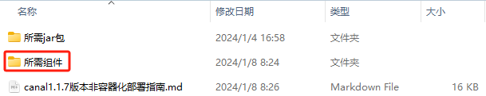
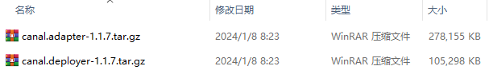
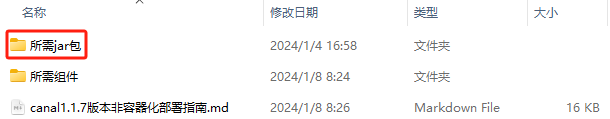
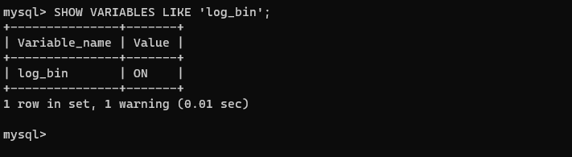
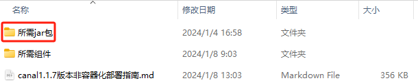
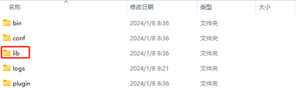
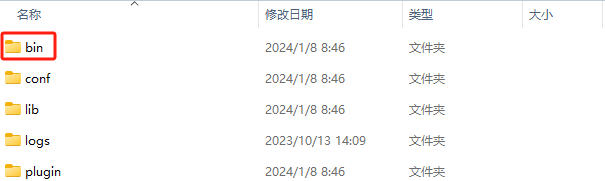
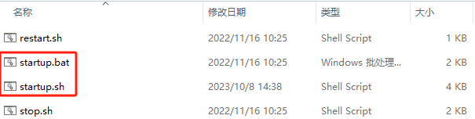

# 环境准备

**Java：JDK11版本；**

**MySQL：8.0.28版本；**

**Canal-deployer：1.1.7版本（2023.10.13最新版本）;**

**Canal-adapter：1.1.7版本（2023.10.13最新版本）；**

Canal版本说明：这个版本同时对MySQL8以及JDK11兼容最好，1.1.6对JDK8兼容不适配，对MySQL8兼容不完全适配，1.1.5版本对MySQL5适配较好，对MySQL8有问题，对JDK11不完全适配）；

==保证以下操作所有文件路径不包含中文==

# Canal组件准备

所需要的Canal组件已经存放在“所需组件”中：





Canal组件的原理类似于主从复制，Canal-deployer伪装成源MySQL的从节点能够实时获取并记录源MySQL中的数据变动和数据值，Canal-adapter就负责将Canal-deployer中的数据读取出来，写入其他数据源，例如MySQL，ES，MQ，Kafka，Redis等，本案例主要为MySQL同步MySQL数据做实现；

这些组件也能直接从官网上下载：

https://github.com/alibaba/canal/releases/tag/canal-1.1.7

# 源Mysql数据准备

1、准备MySQL8.0.X版本的数据库，以及对应版本的JDBC Jar包，这里就以MySQL8.0.28版本为例，Jar包已经存放在了所需Jar包中：




2、开启MySQL的Binlog，这里和MySQL主从库操作一样；

- 首先判断MySQL是否开启二进制日志：`SHOW VARIABLES LIKE 'log_bin';`

  

  ON是开启，OFF是关闭，这里就是开启状态；

- 假如这里没有开启，这里就需要修改MySQL的my.cnf配置文件，Windows下的配置文件通常在**`MySQL8安装目录\ProgramData\MySQL\MySQL Server 8.0\my.ini`**，Linux下配置文件通常是**`/etc/my.cnf`**（优先加载）或者**`/etc/mysql/my.cnf`**或者**`/usr/etc/my.cnf`**或者**`~/.my.cnf`**，可是Windows上MySQL8已经开启了binlog，低版本的需要配置，所以这里以Linux为例，进入文件后找到**[mysqld]**所在的行，在其下方添加如下配置参数：

  ```ini
  server-id		=	2
  log-bin			=	mysql-bin
  binlog-format	=	ROW	
  ```

  然后重启MySQL服务：`systemctl restart mysqld`；

  保险起见，还需要再次查看二进制日志开启情况。

3、添加角色（本演示中使用账号canal/密码canal，要记住这个账号密码），这里和MySQL主从库操作一样；

```mysql
# 创建角色
CREATE USER 'canal'@'%' IDENTIFIED WITH mysql_native_password BY 'canal';
# 分配权限
GRANT SELECT, REPLICATION SLAVE, REPLICATION CLIENT ON *.* TO 'canal'@'%';
# 刷新权限
FLUSH PRIVILEGES;
```

4、开启root角色远程访问权限；

```mysql
use mysql;
# 直接更新MySQL中的user表
update user set host='%' where user='root';
# 刷新权限
FLUSH PRIVILEGES;
```

5、使用Canal账号以命令行的形式登录一次，这一步很重要，不然Canal可能会处于失效状态；

# 目标数据源准备

这里的目标数据源就是另一个MySQL数据库或者同一个MySQL数据库，这个数据库唯一的要求就是事务隔离级别需要修改，MySQL8默认的事务隔离级别是RR（Repeatable Read），需要将其修改成RC（Read Committed），这个是为了防止全量同步时发生死锁问题；

```mysql
# 首先需要查看数据库的隔离级别
select @@transaction_isolation;
# 如果显示不为READ COMMITTED，那么就需要修改
set global transaction isolation level read committed;
# 这里在同一个MySQL会话框中再次查询会不生效，所以需要重新打开会话框进行查询（做到这里可能也不生效，那么就重复上面的操作，直到生效为止）
```

上面这个方案有一个弊端，那就是MySQL重启后依然会被修改为默认事务级别，所以可以将其写入MySQL配置文件中，和源MySQL数据准备中的配置文件位置一样：

```ini
[mysqld]
...
transaction-isolation	=	READ-COMMITTED
...
```

# 部署Canal-deployer

解压“所需组件”中的**canal.deployer-1.1.7.tar.gz**，有以下文件夹：


主要关注这里面的`conf/example/instance.properties`文件：

**instance.properties文件示例：**

```properties
#################################################
## mysql serverId , v1.0.26+ will autoGen
# canal.instance.mysql.slaveId=0

# enable gtid use true/false
canal.instance.gtidon=false

# position info（这里第一个项需要改成源MySQL的地址以及端口号）
canal.instance.master.address=127.0.0.1:3306
canal.instance.master.journal.name=
canal.instance.master.position=
canal.instance.master.timestamp=
canal.instance.master.gtid=

# rds oss binlog
canal.instance.rds.accesskey=
canal.instance.rds.secretkey=
canal.instance.rds.instanceId=

# table meta tsdb info
canal.instance.tsdb.enable=true
#canal.instance.tsdb.url=jdbc:mysql://127.0.0.1:3306/canal_tsdb
#canal.instance.tsdb.dbUsername=canal
#canal.instance.tsdb.dbPassword=canal

#canal.instance.standby.address =
#canal.instance.standby.journal.name =
#canal.instance.standby.position =
#canal.instance.standby.timestamp =
#canal.instance.standby.gtid=

# username/password（这里需要修改成源MySQL数据准备时创建的用户账号密码，即源数据库准备中第3步创建的canal/canal）
canal.instance.dbUsername=canal
canal.instance.dbPassword=canal
canal.instance.connectionCharset = UTF-8
# enable druid Decrypt database password
canal.instance.enableDruid=false
#canal.instance.pwdPublicKey=MFwwDQYJKoZIhvcNAQEBBQADSwAwSAJBALK4BUxdDltRRE5/zXpVEVPUgunvscYFtEip3pmLlhrWpacX7y7GCMo2/JM6LeHmiiNdH1FWgGCpUfircSwlWKUCAwEAAQ==

# table regex
canal.instance.filter.regex=.*\\..*
# table black regex
canal.instance.filter.black.regex=mysql\\.slave_.*
# table field filter(format: schema1.tableName1:field1/field2,schema2.tableName2:field1/field2)
#canal.instance.filter.field=test1.t_product:id/subject/keywords,test2.t_company:id/name/contact/ch
# table field black filter(format: schema1.tableName1:field1/field2,schema2.tableName2:field1/field2)
#canal.instance.filter.black.field=test1.t_product:subject/product_image,test2.t_company:id/name/contact/ch

# mq config
canal.mq.topic=example
# dynamic topic route by schema or table regex
#canal.mq.dynamicTopic=mytest1.user,topic2:mytest2\\..*,.*\\..*
canal.mq.partition=0
# hash partition config
#canal.mq.enableDynamicQueuePartition=false
#canal.mq.partitionsNum=3
#canal.mq.dynamicTopicPartitionNum=test.*:4,mycanal:6
#canal.mq.partitionHash=test.table:id^name,.*\\..*
#
# multi stream for polardbx
canal.instance.multi.stream.on=false
#################################################
```

# 部署Canal-adapter

解压“所需组件”中的**canal.adapter-1.1.7.tar.gz**，有以下文件夹：


部署 Canal-adapter 前需要为其补充一个 MySQL8 版本的驱动 Jar 包，该 Jar 包在”所需jar包“里：




将这个 Jar 包移动至 lib 文件夹下：



完成之后即可开始部署。

>  **注意：**在这里需要明确一个条件，对于业务逻辑而言，同步的两表表结构大概率是相同的，因为Canal可以实现非相同表结构的同步逻辑，但是由于各个表字段数据结构不同，非全映射配置是一种挺危险的操作，这里就以全映射表结构同步为例。）

需要关注这里面的`conf/application.yml`文件（库的定义文件）和`conf/rdb/mytest_user.yml`文件（表的定义文件），这里假设我们需要同步源MySQL中的user表到目标数据库A中user表中，那么建议将`mytest_user.yml`文件文件名改为`库名_表名`，即A_user.yml，如果库名相同，那么就改为`hostname_库名_表名`，反正要有迹可循，方便以后做程序拓展，如果要将源MySQL中的数据同步至多个不同库不同表或者相同库不同表，命名方式都要有迹可循，至于库的定义，关键就在于application.yml文件当中。

**application.yml文件（库定义）示例：**

```yml
server:
  # canal-adapter程序运行占用端口
  port: 8081
spring:
  # 序列化配置
  jackson:
    date-format: yyyy-MM-dd HH:mm:ss
    time-zone: GMT+8
    default-property-inclusion: non_null
# 以下配置是Canal-adapter的具体配置，没有的项就是可以不填的项，有中文说明的项就是比较重要的项
canal.conf:
  mode: tcp #模式有tcp > kafka > rocketMQ > rabbitMQ四种
  flatMessage: true
  # 如果要做高可用，就需要zookeeper作为注册中心填写在这里，没有就不填
  zookeeperHosts:
  syncBatchSize: 1000
  retries: -1
  timeout:
  accessKey:
  secretKey:
  consumerProperties:
    # 这里需要填写Canal-deployer的ip:port
    canal.tcp.server.host: 127.0.0.1:11111
    canal.tcp.zookeeper.hosts:
    canal.tcp.batch.size: 500
    canal.tcp.username:
    canal.tcp.password:
    # kafka consumer
    kafka.bootstrap.servers: 127.0.0.1:9092
    kafka.enable.auto.commit: false
    kafka.auto.commit.interval.ms: 1000
    kafka.auto.offset.reset: latest
    kafka.request.timeout.ms: 40000
    kafka.session.timeout.ms: 30000
    kafka.isolation.level: read_committed
    kafka.max.poll.records: 1000
    # rocketMQ consumer
    rocketmq.namespace:
    rocketmq.namesrv.addr: 127.0.0.1:9876
    rocketmq.batch.size: 1000
    rocketmq.enable.message.trace: false
    rocketmq.customized.trace.topic:
    rocketmq.access.channel:
    rocketmq.subscribe.filter:
    # rabbitMQ consumer
    rabbitmq.host:
    rabbitmq.virtual.host:
    rabbitmq.username:
    rabbitmq.password:
    rabbitmq.resource.ownerId:
  # 这里是源数据库的配置，可以有多个数据源
  srcDataSources:
    # defaultDS可以自定义，只是一个别称，但建议别改，因为和该指南下重的其他配置文件有关
    defaultDS:
      # 下面是源数据库相关配置，请使用MySQL8的数据库
      url: jdbc:mysql://127.0.0.1:3306/canal_read?serverTimezone=Asia/Shanghai&useUnicode=true&characterEncoding=utf-8&zeroDateTimeBehavior=convertToNull&useSSL=false&allowPublicKeyRetrieval=true&rewriteBatchedStatements=true
      username: root
      password: 123456
      maxActive: 10 #Druid线程数量，极为重要的一个参数，全量同步的丢数据问题就源自于这里，windows中该值至少为10就即可，docker/linux中该值至少为12即可
  canalAdapters:
  - instance: example # 这是示例名称，也可以自定义，但建议别改，因为和该指南下重的其他配置文件有关
    # 此处还能细分成组，也为上面文件夹的命名有迹可循唯一性提供了另一种思路
    groups:
    - groupId: g1
      # 此处就写具体的adapter，adapter可以看成目标数据源，有如下一些类型：logger（日志类型），rdb（关系型数据库），hbase（大数据存储引擎），es（搜索引擎）等；
      outerAdapters:
      - name: logger
      - name: rdb
        # key值就是这个adapter的唯一值
        key: mysql1
        # 目标数据源相关配置
        properties:
          jdbc.driverClassName: com.mysql.cj.jdbc.Driver
          jdbc.url: jdbc:mysql://10.10.18.175:3306/canal_write?serverTimezone=Asia/Shanghai&useUnicode=true&characterEncoding=utf-8&zeroDateTimeBehavior=convertToNull&useSSL=false&allowPublicKeyRetrieval=true&rewriteBatchedStatements=true
          jdbc.username: root
          jdbc.password: 123456
          druid.stat.enable: true
          druid.stat.slowSqlMillis: 1000
      - name: rdb
        key: mysql2
        properties:
          jdbc.driverClassName: com.mysql.cj.jdbc.Driver
          jdbc.url: jdbc:mysql://10.10.18.207:3306/canal_write?serverTimezone=Asia/Shanghai&useUnicode=true&characterEncoding=utf-8&zeroDateTimeBehavior=convertToNull&useSSL=false&allowPublicKeyRetrieval=true&rewriteBatchedStatements=true
          jdbc.username: root
          jdbc.password: 123456
          druid.stat.enable: true
          druid.stat.slowSqlMillis: 1000
#      - name: rdb
#        key: oracle1
#        properties:
#          jdbc.driverClassName: oracle.jdbc.OracleDriver
#          jdbc.url: jdbc:oracle:thin:@localhost:49161:XE
#          jdbc.username: mytest
#          jdbc.password: m121212
#      - name: rdb
#        key: postgres1
#        properties:
#          jdbc.driverClassName: org.postgresql.Driver
#          jdbc.url: jdbc:postgresql://localhost:5432/postgres
#          jdbc.username: postgres
#          jdbc.password: 121212
#          threads: 1
#          commitSize: 3000
#      - name: hbase
#        properties:
#          hbase.zookeeper.quorum: 127.0.0.1
#          hbase.zookeeper.property.clientPort: 2181
#          zookeeper.znode.parent: /hbase
#      - name: es
#        hosts: 127.0.0.1:9300 # 127.0.0.1:9200 for rest mode
#        properties:
#          mode: transport # or rest
#          # security.auth: test:123456 #  only used for rest mode
#          cluster.name: elasticsearch
#      - name: kudu
#        key: kudu
#        properties:
#          kudu.master.address: 127.0.0.1 # ',' split multi address
#      - name: phoenix
#        key: phoenix
#        properties:
#          jdbc.driverClassName: org.apache.phoenix.jdbc.PhoenixDriver
#          jdbc.url: jdbc:phoenix:127.0.0.1:2181:/hbase/db
#          jdbc.username:
#          jdbc.password:
```

**mytest_user.yml文件（表定义）示例：**

```yml
# 数据源的Key（和库定义中对应）
dataSourceKey: defaultDS
# 示例名称（和库定义中对应）
destination: example
# 分组id（和库定义中对应）
groupId: g1
# adapter——目标数据源的key（和库定义中对应）
outerAdapterKey: mysql1 # 这个是test_h库，如果是test_z库，那么这个key应该是mysql2
concurrent: true
dbMapping:
#  mirrorDb: true
  # 源MySQL数据库
  database: canal_read
  # 源数据库的表名称
  table: demo_table
  # 目标数据的表名称
  targetTable: demo_table
  # 目标主键（源表主键名:目标表主键名）
  targetPk:
    id: id
  mapAll: true # 映射所有字段，这里改为true的话，下面的targetColumns就可以不用改了，除非两边的数据结构不一样
#  targetColumns:
#    id: device_id
#    name:
#    role_id:
#    c_time:
#    test1:
#  etlCondition: "where collect_noisedetector_id is not null"
  commitBatch: 1000 # 批量提交的大小

## Mirror schema synchronize config
#dataSourceKey: defaultDS
#destination: example
#groupId: g1
#outerAdapterKey: mysql1
#concurrent: true
#dbMapping:
#  mirrorDb: true
#  database: mytest
```

# 启动项目

从上面的一系列描述也能看出Canal-deployer启动是Canal-adapter启动的前提，那么首先启动Canal-deployer；

这个组件启动的脚本在bin文件夹中：





`.bat`文件是Windows下的组件启动脚本，`.sh`文件是Linux下的组件启动脚本，只要在命令行中运行他们即可；

```shell
./start.bat
或
./start.sh
```

然后启动Canal-adapter，开启方法和Canal-deployer一样：


```shell
./start.bat
或
./start.sh
```

# 同步说明

一旦部署上，整个Canal就会根据Canal-adapter中配置的 `/conf/rdb/mytest_user.yml` 进行增量同步，如果想全量同步就需要通过HTTP向Canal-adapter发送请求，Canal-adapter的启动端口默认8081，以 `/conf/rdb/mytest_user.yml` 为例请求如下：

```http
GET http://127.0.0.1:8081/etl/rdb/mytest_user.yml
```

全量同步会中止增量同步，当全量同步完成之后会从中止断点继续增量同步。
