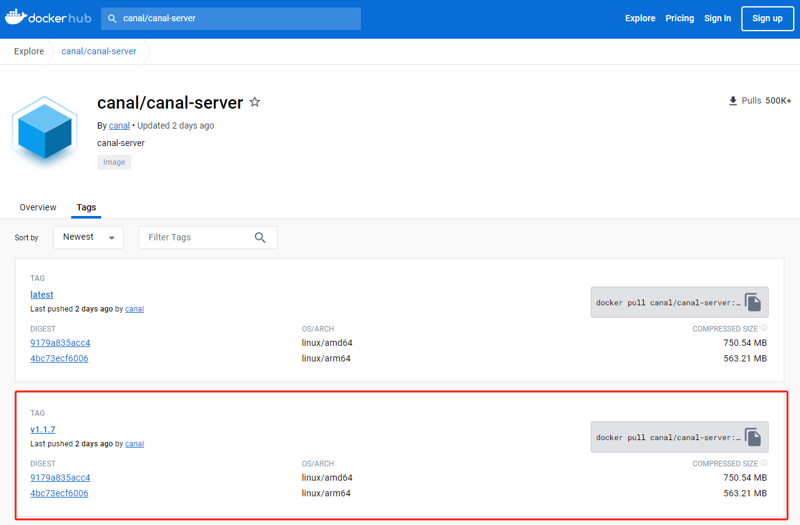
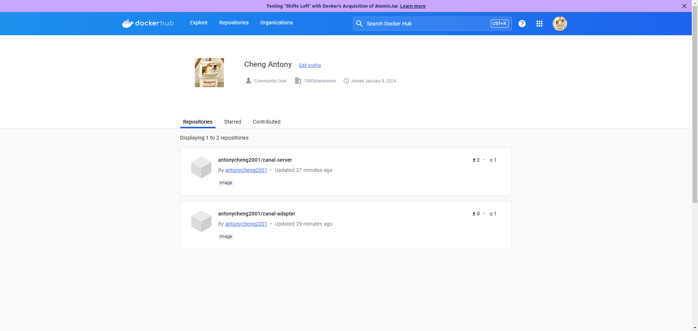
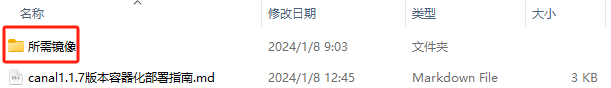

# 注意事项

**请优先阅读非容器话部署指南，里面包含了所有的注意事项，这里针对Canal-deployer和Canal-adapter两个组件的镜像做基础介绍以及部署方法；**

# 镜像介绍

Canal-deployer的镜像在Dockerhub上由官方发布（Canal-deployer的别名也就是Canal-server），1.1.7最新版本也在发布在了上面：



这里可以直接进行拉取，但为了方便部署Canal-adapter，建议遵循以下拉取方式：

首先访问 `https://hub.docker.com/u/antonycheng2001` ：



然后拉取上面这两个镜像：

```shell
# 拉取canal-deployer
docker pull antonycheng2001/canal-server:v1.1.7
# 拉取canal-adapter
docker pull antonycheng2001/canal-adapter:v1.1.7
```

# 镜像部署

==注意：镜像部署之前需要将非容器化指南中的对非Canal组件的操作和注意事项全部做完；==

如果是按照上面步骤从官方拉取的镜像，那么可以直接进行部署，如果由于网络问题无法拉取，也可以直接使用“所需镜像“中的镜像：




导入这两个镜像即可：

```sh
docker load < canal.deployer-1.1.7.tar
docker load < canal.adapter-1.1.7.tar
```

**部署Canal-deployer：**

```shell
# 首先运行一个容器
docker run -p 11111:11111 --name canal-deployer -d antonycheng2001/canal-server:v1.1.7

# 然后获取镜像中的配置文件
docker cp canal-deployer:/home/admin/canal-server/conf /opt/data/canal/canal-deployer

# 再强制删除运行的镜像
docker rm -f canal-deployer

# 这里就需要更改配置文件，这一系列操作在非容器化指南中已有说明，这里不再讨论
# 修改完之后重新挂载文件夹进行部署
docker run -itd --name canal-deployer -p 11111:11111 -v /opt/data/canal/canal-deployer/conf:/home/admin/canal-server/conf antonycheng2001/canal-server:v1.1.7
```

**部署Canal-adapter:**

```shell
# 首先运行一个容器
docker run -p 8081:8081 --name canal-adapter -d antonycheng2001/canal-adapter:v1.1.7

# 然后获取镜像中的配置文件
docker cp canal-adapter:/opt/canal-adapter/conf /opt/data/canal/canal-adapter

# 再强制删除运行的镜像
docker rm -f canal-adapter

# 这里就需要更改配置文件，这一系列操作在非容器化指南中已有说明，这里不再讨论
# 修改完之后重新挂载文件夹进行部署
docker run -itd --name canal-adapter -p 8081:8081 -v /opt/data/canal/canal-adapter/conf:/opt/canal-adapter/conf antonycheng2001/canal-adapter:v1.1.7
```

# 同步说明

一旦部署上，整个Canal就会根据Canal-adapter中配置的 `/conf/rdb/mytest_user.yml` 进行增量同步，如果想全量同步就需要通过HTTP向Canal-adapter发送请求，Canal-adapter的启动端口默认8081，以 `/conf/rdb/mytest_user.yml` 为例请求如下：

```http
GET http://127.0.0.1:8081/etl/rdb/mytest_user.yml
```

全量同步会中止增量同步，当全量同步完成之后会从中止断点继续增量同步。
